# Gestor de Expedientes e Indicios — Frontend (React + Vite + TS)

SPA para gestionar **expedientes** e **indicios** con login JWT, control de acceso por **rol** (técnico | coordinador), pantallas CRUD y una intro/splash al iniciar sesión.

## Tech stack

- React 18 + TypeScript
- Vite
- React Router v6
- Tailwind CSS (modo dark por defecto)
- Axios (servicios HTTP)
- Lucide-react (iconos)

## Requisitos

- Node.js ≥ 18
- npm
- Backend corriendo en `http://localhost:3000/api` (ajustable con variable de entorno)

---

## Autenticación & Autorización

- **Login**: `POST /auth/login` → guarda `access_token` (y opcional `refresh_token`) en `localStorage`.
- **Guards**:
  - `ProtectedRoute` verifica sesión y redirige a `/login`.
  - `RoleRoute` sólo permite **coordinador** para la sección **Usuarios**.
- **Header**: muestra usuario, rol, estado y botón **Cerrar sesión**.
- **Intro/Splash**: tras login se navega a `/Splash` y luego al dashboard con un **fade** oscuro.

---

## Páginas clave

- **Dashboard (`/`)**
  - Accesos a **Expedientes**, **Indicios** y **Usuarios** (esta última sólo coordinador).

- **Expedientes**
  - Lista (filtros por estado/código), detalle, cambio de estado (aprobar/rechazar con justificación), activar/desactivar, crear/editar con modal.

- **Indicios**
  - Por expediente (`/expedientes/:id/indicios`): crear, editar (modal), activar/desactivar, validación de expediente existente.

- **Usuarios** *(sólo coordinador)*
  - Listado paginado, búsqueda por texto, creación con feedback de errores enviados por el backend.

- **Acerca de (`/about`)**
  - Información del sistema, autor y contactos (correo/teléfono como links).

---

## 🎥 Demostración del sistema

### 🔑 Inicio de sesión 


### 🏠 Dashboard

**Dashboard coordinador**
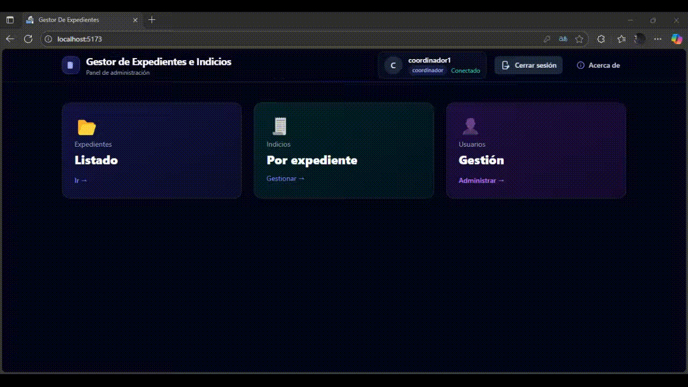

**Dashboard tecnico**
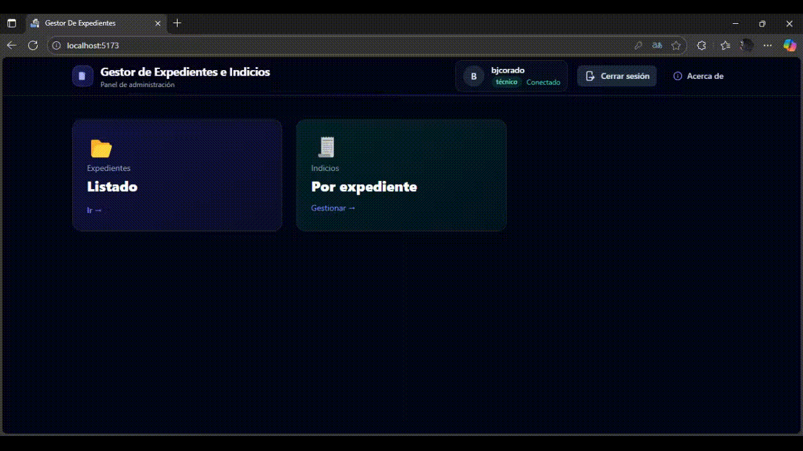


### 📂 Gestión de Expedientes
**Expedientes coordinador**


**Expedientes tecnico**
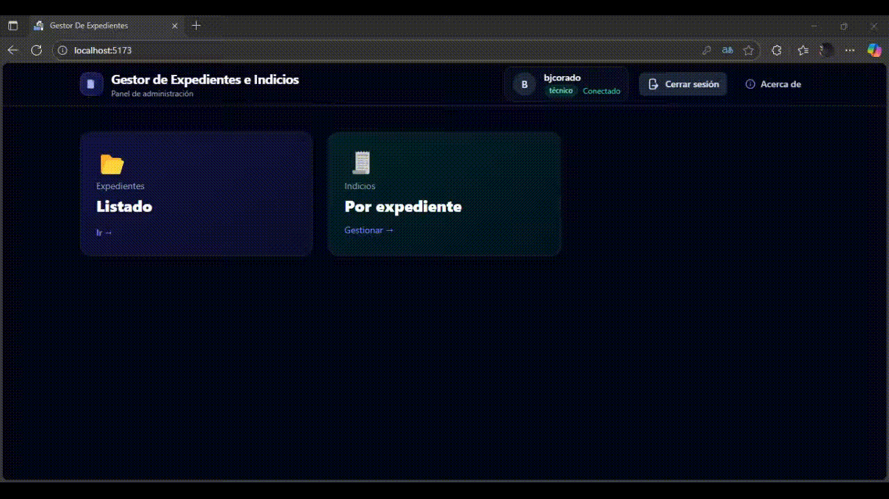

**Crear Expedientes**
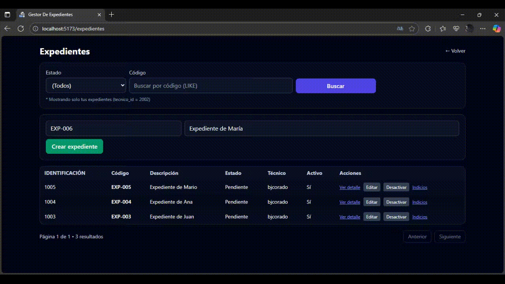

**Editar Expedientes**
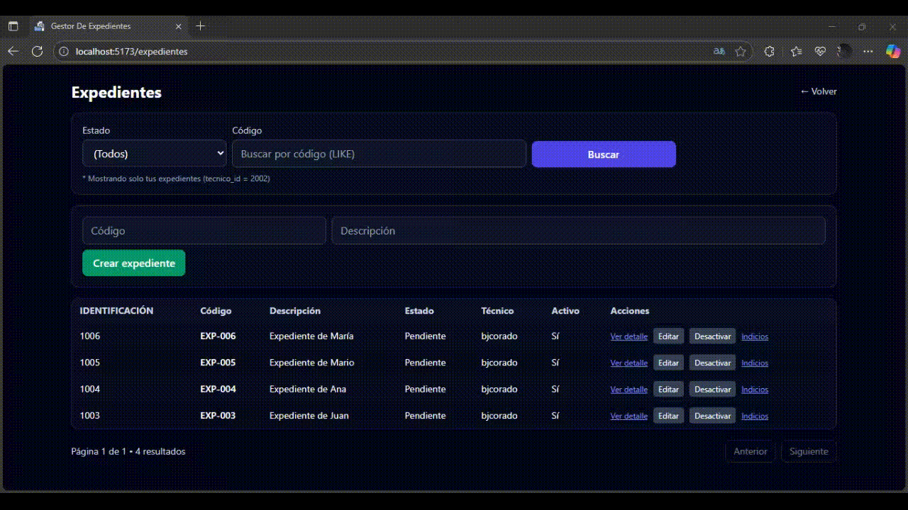

**Aprobar Expedientes**
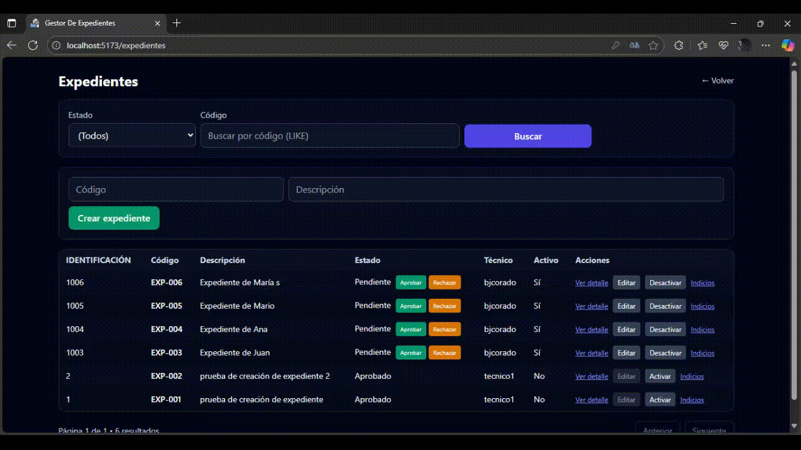

**Rechazar Expedientes**
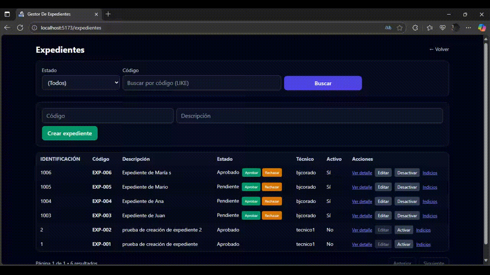

**Expedientes activar/desactivar**


**Expedientes indicios**
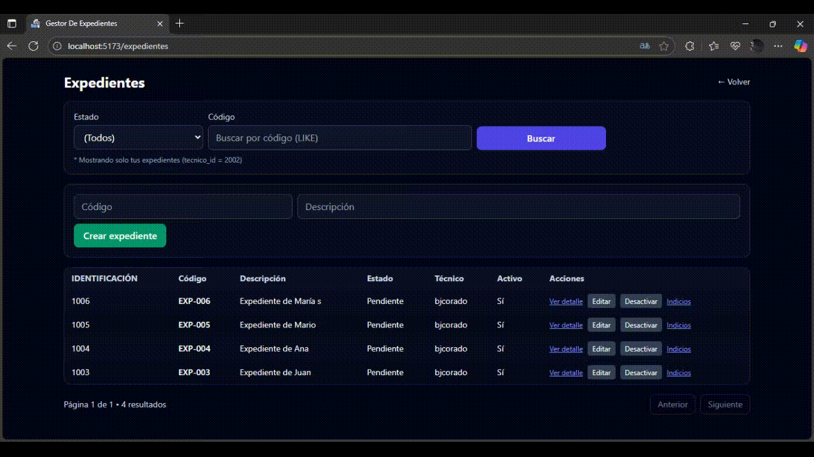

### 🧾 Indicios por expediente
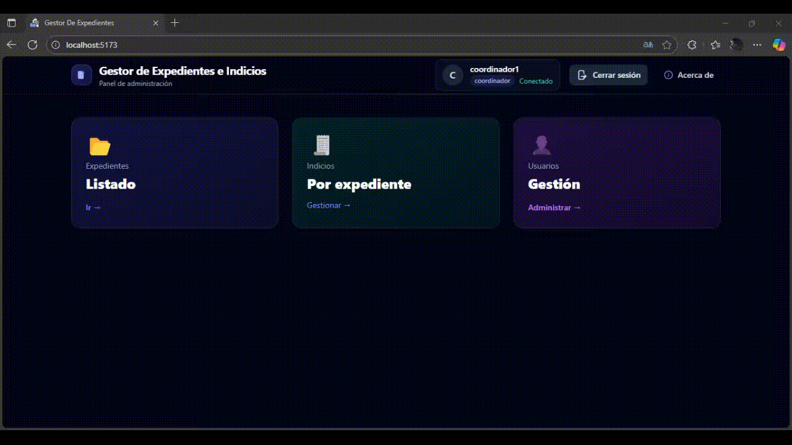

**Crear Indicios**
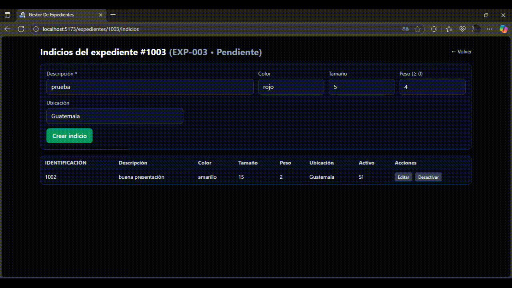

**Editar Indicios**
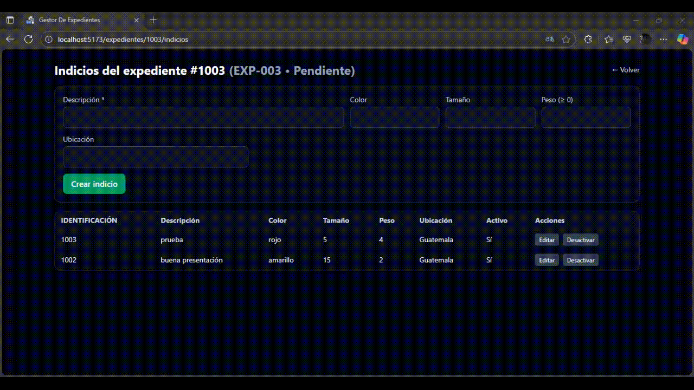

### 👤 Gestión de Usuarios (solo coordinador)
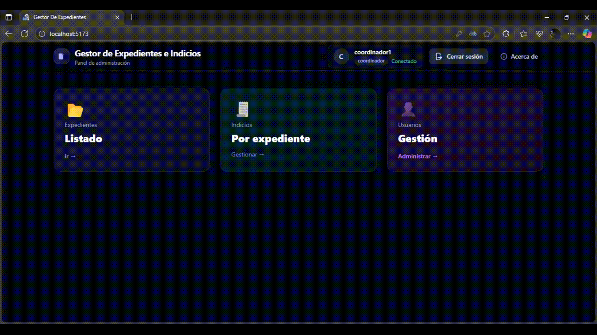

**Crear Usuarios**
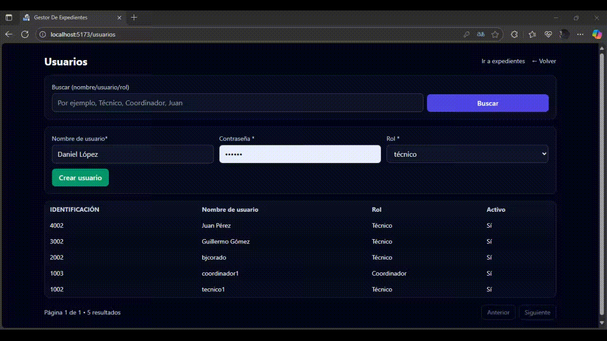

### ℹ️ Acerca de / Información


---

## Configuración

1) **Clona** el repo y entra al proyecto:

```bash
git clone https://github.com/BJCorado/FRONTEND_Gestion_de_Expedientes_e_Indicios.git
cd expediente-ui
```
2) **Instala dependencias**

```bash
npm install

```

4) **Configura variables de entorno**
en .env

```bash
VITE_API_URL=http://localhost:3000/api   #URL del backend
# edita VITE_API_BASE_URL si tu backend usa otro host/puerto
```

5) **scripts**

```bash
# desarrollo con HMR
npm run dev

# compilar a producción
npm run build

# previsualizar build
npm run preview
```
La app estará en http://localhost:5173 (por defecto Vite).